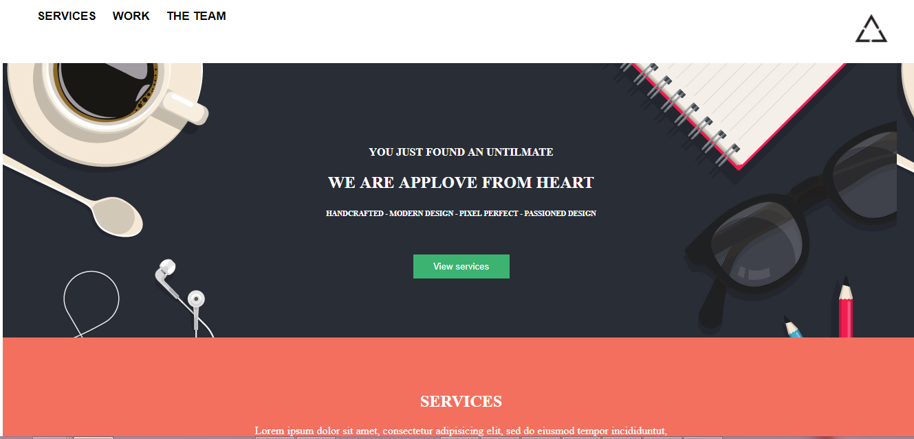

# AppLove

EN ESTA PAGINA ENCONTRAREMOS NUESTRO MAQUETADO Y ESTRUCTURA DE LA PAGINA AppLove Y PARA ELLO REALIZAMOS LO SIGUIENTE:

**EN NUESTRO ARCHIVO HTML TENEMOS:**

LA ESTRUCTURA O EL MAQUETADO DE NUESTRA GALERIA CON EL HTML SEMANTICO.
>HEADER
>NAV
>SECTION
>FIGURE
>FOOTER

**EN NUESTRO ARCHIVO CSS TENDREMOS :**
UTILIZANDO DIFERENTES **SELECTORES** SE HA PODIDO REPLICAR ESTILOS PARA ESTE PROYECTO.
UTILIZANDO LAS PROPIEDADES:
>display
>position
>icon
>font
>float

**TAMBIEN SE UTILIZO CLASES REUTILIZABLES COMO**
> * SELECTOR UNIVERSAL
> text-uppercase

NUESTRO PRODUCTO FINAL SERA EL SIGUIENTE :

